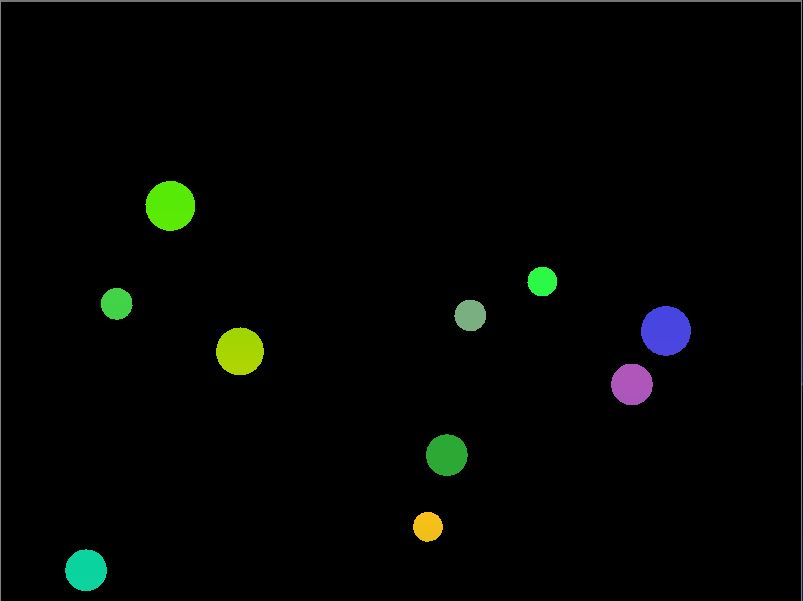

# Physics Simulator

This is a simple physics simulator using the LÖVE framework. It simulates balls bouncing around the screen with basic physics including gravity, friction, and rotation. Additionally, a shader effect is applied to the balls to create a wave-like distortion.

## Features

- **Gravity**: Each ball is affected by a downward force.
- **Friction**: Reduces the speed of the balls over time.
- **Rotation**: Balls rotate as they move, with varying angular speeds.
- **Bouncing**: Balls bounce off the screen edges, reversing their velocity when they hit the boundaries.
- **Shader Effect**: A custom shader adds a wave-like distortion to the red color channel of the balls.

## How to run
- install Löve + lua
- download the files from this repo
- open the main.lua file in vscode
- press alt + l and the game starts

  
